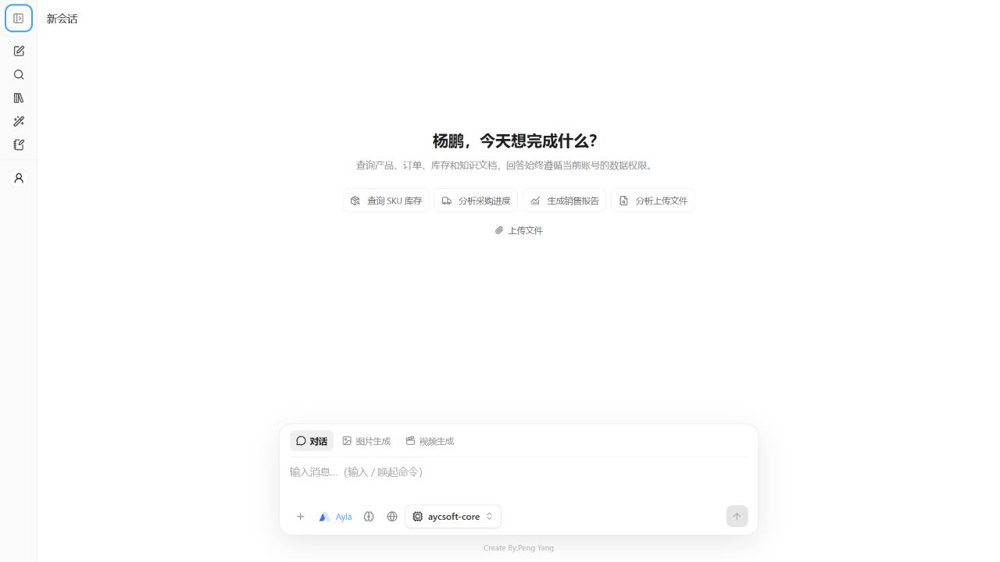
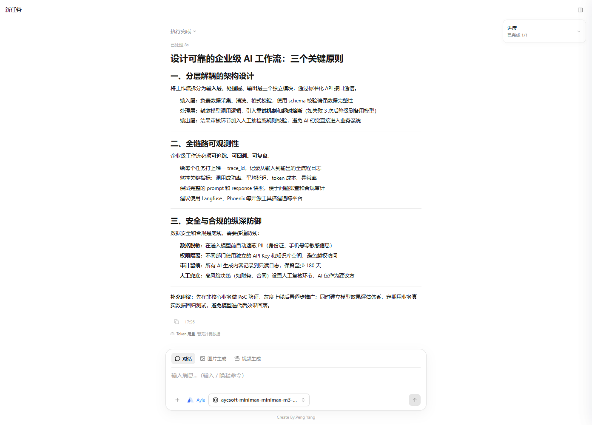
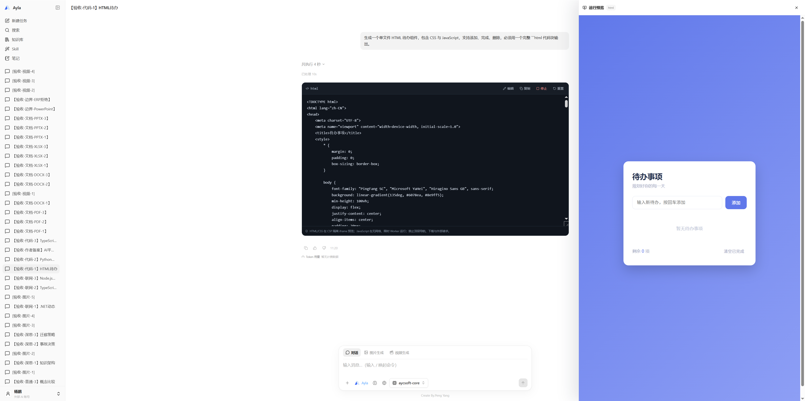
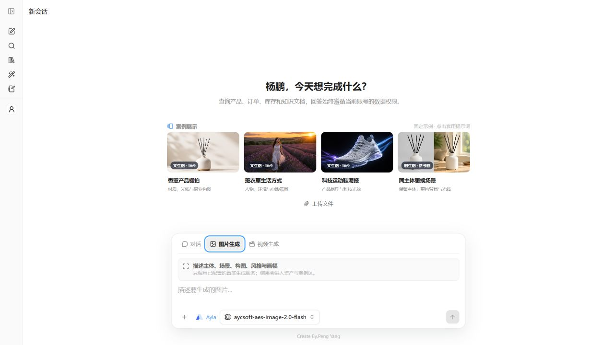
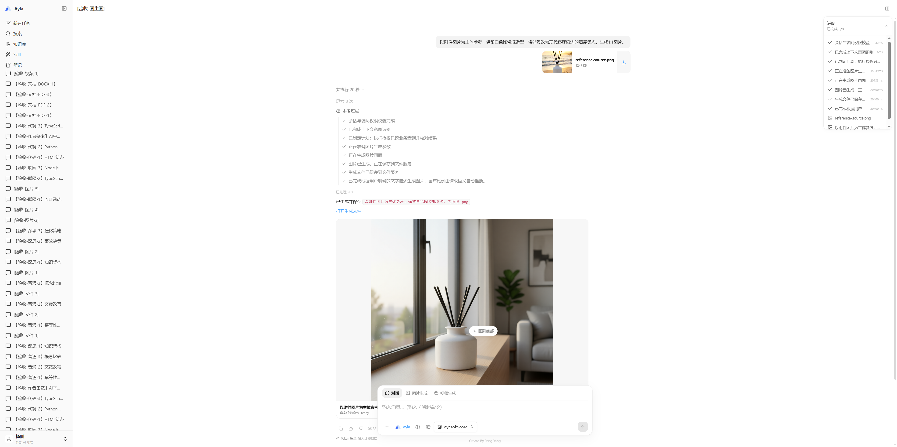
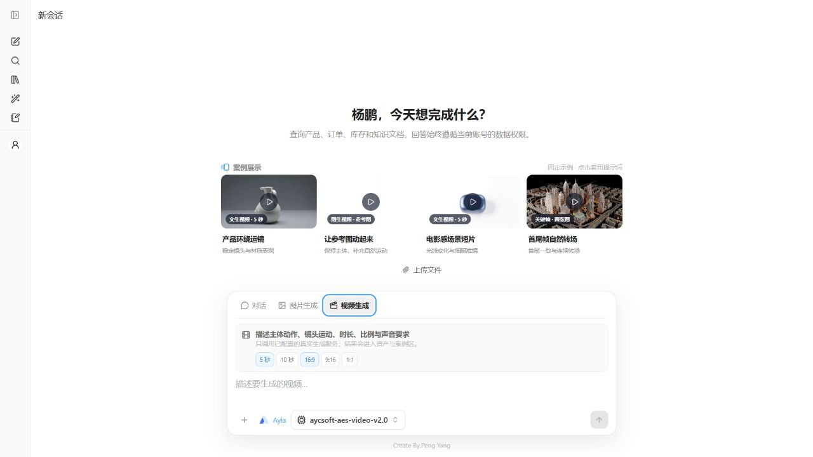
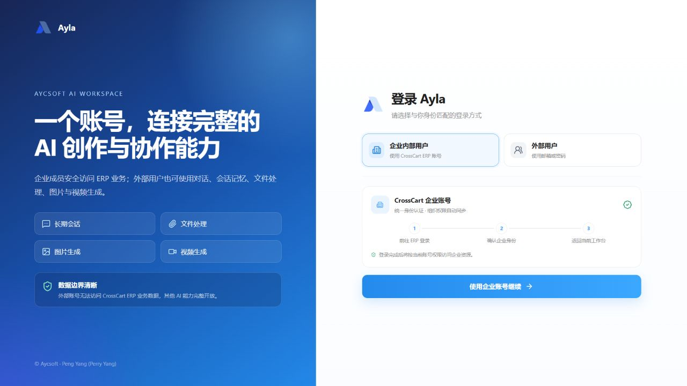
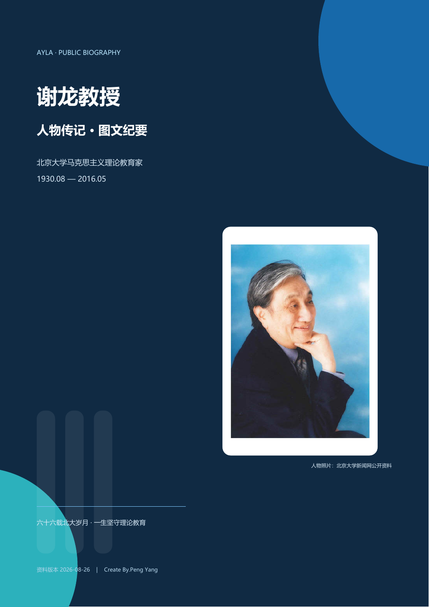
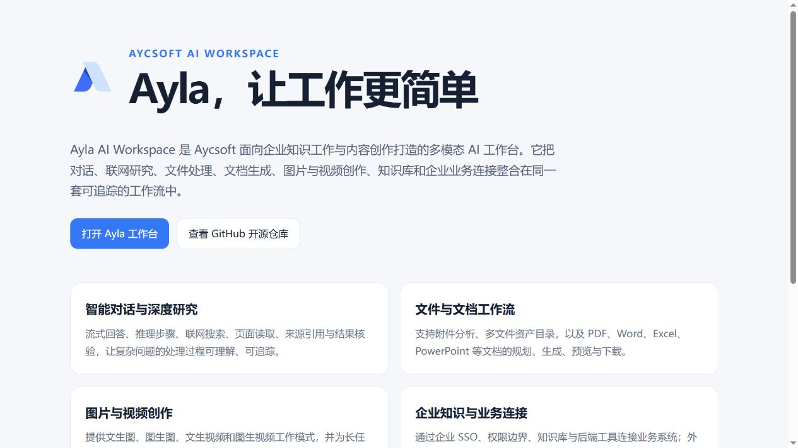
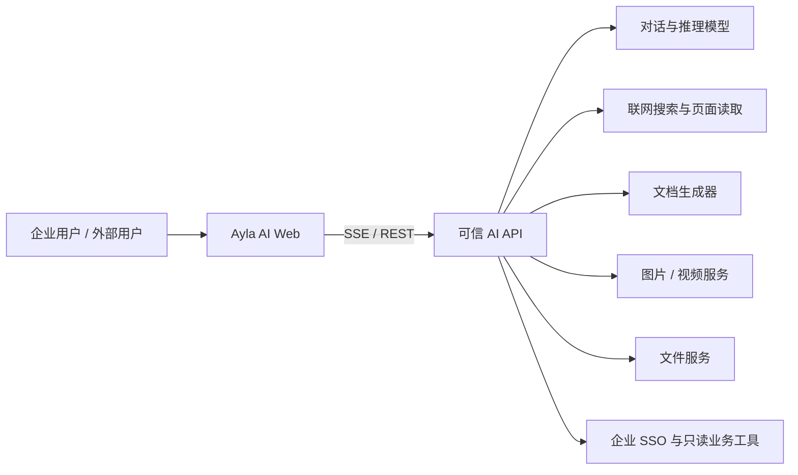

# Ayla AI Workspace

> **Aycsoft.Ayla.AI.Web** — 面向企业知识工作、联网研究、文件处理与多模态创作的开源 Vue 3 AI 工作台。

[](https://vuejs.org/)
[](https://www.typescriptlang.org/)
[](https://github.com/Aycsoft/Aycsoft.Ayla.AI.Web/actions/workflows/ci.yml)
[](LICENSE)

**Ayla AI Workspace** 是 Aycsoft 打造的一体化企业 AI Web 客户端。它不是只有输入框和文本输出的聊天套壳，而是把智能对话、深度思考、联网检索、来源核验、附件分析、文档生成、图片与视频创作、代码预览、知识库、Skill、笔记与企业 SSO 组织成可持续工作的任务空间。

本仓库是 Ayla 的开源 Web 客户端，不包含模型密钥、数据库凭据或 CrossCart.AI 服务端源代码。模型调用、内容安全、权限校验、文件存储和业务数据访问必须由可信后端实现。

## 界面预览

### 工作台首页



### 流式对话、执行链路与来源



### 代码生成预览



### 图片生成工作区



### 以图生图工作区



### 视频生成工作区



### 企业与外部账户入口



### 图文文档生成结果



<!-- ### 搜索引擎可抓取的项目介绍页 -->

<!--  -->

## 核心能力

| 能力域     | 已实现的交互                                                          |
| ---------- | --------------------------------------------------------------------- |
| 智能对话   | SSE 流式输出、深度思考、执行步骤、实时耗时、停止与重试、模型故障恢复  |
| 联网研究   | 搜索、页面读取、来源卡片、网站图标、引用去重、默认折叠与可核验链接    |
| 文件处理   | 多附件上传、历史附件恢复、预览和下载、文件类型识别、任务资产目录      |
| 文档生成   | 文档规划、阶段进度、PDF / DOCX / XLSX / PPTX 结果、右侧工作区预览     |
| 多模态生成 | 独立图片与视频模式、文生图、图生图、文生视频、图生视频、固定案例提示  |
| 代码工作区 | Markdown / GFM、语法高亮、代码复制、文件树、HTML 安全运行预览         |
| 会话管理   | 最近 / 近 7 天 / 近 30 天分组、分页加载、搜索、重命名、删除、运行状态 |
| 用户与协作 | 企业 SSO、外部邮箱账户、密码、头像、个人资料、会话记忆、反馈中心      |
| 知识生产   | 知识库、用户 Skill、Markdown 笔记与可复用的输出规范                   |
| 可观测性   | Token 用量、阶段状态、预计耗时、健康检查和不会击穿整页的错误提示      |

## 系统边界



- 浏览器只持有用户会话，不保存 Provider API Key、邮件授权码或内部签名密钥。
- 业务数据访问由后端基于当前用户权限执行；外部账户不能穿透企业数据边界。
- AI Web 对后端能力使用统一契约，本地模型与 API 模型可以在服务端切换而不改变前端业务流程。
- 图片、视频、文档和上传附件均以资产记录返回，支持历史恢复、预览和下载。

详细架构与事件协议见 [docs/architecture.md](docs/architecture.md)。

## 技术栈

- Vue 3.5、TypeScript 5.7、Vite 6
- Pinia、Vue Router、Element Plus、UnoCSS
- Markdown-It、脚注、任务列表和富文本扩展
- Vitest、Vue Type Check
- ASP.NET Core 轻量静态代理宿主或 Nginx

## 快速开始

要求 Node.js 22.13+、pnpm 9+，以及运行在 `localhost:5088` 的兼容 AI API。

```powershell
git clone https://github.com/Aycsoft/Aycsoft.Ayla.AI.Web.git
cd Aycsoft.Ayla.AI.Web
Copy-Item .env.example .env.local
pnpm install --frozen-lockfile
pnpm dev
```

访问 `http://localhost:5176/ai-workbench/`。默认 API 和 Portal 地址分别为 `http://localhost:5088`、`http://localhost:4000`。

## 环境变量

| 变量                       | 用途                                             |
| -------------------------- | ------------------------------------------------ |
| `VITE_API_BASE_URL`        | 浏览器访问的 API 根路径；生产同源部署推荐 `/api` |
| `VITE_DEV_PROXY_TARGET`    | Vite 本地开发代理目标                            |
| `VITE_APP_BASE_PATH`       | Web 部署子路径，默认 `/ai-workbench/`            |
| `VITE_SSO_LOGIN_URL`       | 企业 SSO 授权入口                                |
| `VITE_PORTAL_ORIGIN`       | CrossCart Portal 地址                            |
| `VITE_WORKSPACE_ORIGIN`    | 可选的正式 AI 域名，用于统一企业 SSO 回跳地址    |
| `VITE_DEFAULT_AI_LOGO_URL` | 未配置服务端 Logo 时使用的透明 Logo              |
| `VITE_HOST`                | 开发和预览监听地址，默认 `0.0.0.0`               |
| `VITE_PORT`                | 本地开发端口，默认 `5176`                        |

> 不要把 API Key、邮箱授权码、数据库连接串或签名密钥写入 `VITE_*`。所有 Vite 环境变量都会进入浏览器产物。

## 后端接口与流式事件

- `/api/public/*`：无需登录的设置、模型目录与公共对话。
- `/api/sso/*`：企业 SSO 会话兑换和退出。
- `/api/external-auth/*`：外部用户注册、登录与密码管理。
- `/api/workspace/*`：会话、消息、附件、生成任务、用量、个人资料、知识库、Skill 与笔记。

流式对话使用 SSE，客户端支持 `meta`、`delta`、`citation`、`web-source`、`tool`、`agent`、`artifact`、`usage`、`done` 和 `error` 等事件，并在连接中断后保留用户输入和可重试状态。

## 验证

```powershell
pnpm check
```

## Docker 与 Nginx

开发规范见 [代码规范](docs/coding-standards.md)，模块边界见 [架构说明](docs/architecture.md)，完整文件目录见 [文件清单](docs/file-inventory.md)。`pnpm check` 同时运行格式、lint、文件清单、类型、测试与生产构建。

仓库包含两种发布宿主：

- [`deploy/Dockerfile.kestrel`](deploy/Dockerfile.kestrel)：ASP.NET Core 静态文件与 API 反向代理宿主。
- [`deploy/Dockerfile.prebuilt`](deploy/Dockerfile.prebuilt)：Nginx 静态站点与 SSE 反向代理宿主。

完整 Nginx 示例、转发头、SPA 回退、SSE 超时和健康检查见 [`deployment/nginx`](deployment/nginx)。生产环境应使用公开 HTTPS 域名，并同步配置 SSO 回跳地址和后端允许列表。

## 作者与品牌

- Creator: **杨鹏（Peng Yang / Perry Yang / YangPeng）**
- GitHub: [Aycsoft](https://github.com/Aycsoft)
- Repository: [Aycsoft/Aycsoft.Ayla.AI.Web](https://github.com/Aycsoft/Aycsoft.Ayla.AI.Web)

## 安全、贡献与许可

安全问题请不要直接创建包含密钥或利用细节的公开 Issue，详见 [SECURITY.md](SECURITY.md)。欢迎通过 Issue 与 Pull Request 参与改进，开发流程见 [CONTRIBUTING.md](CONTRIBUTING.md)。

[MIT](LICENSE) © Peng Yang (Perry Yang), Aycsoft
